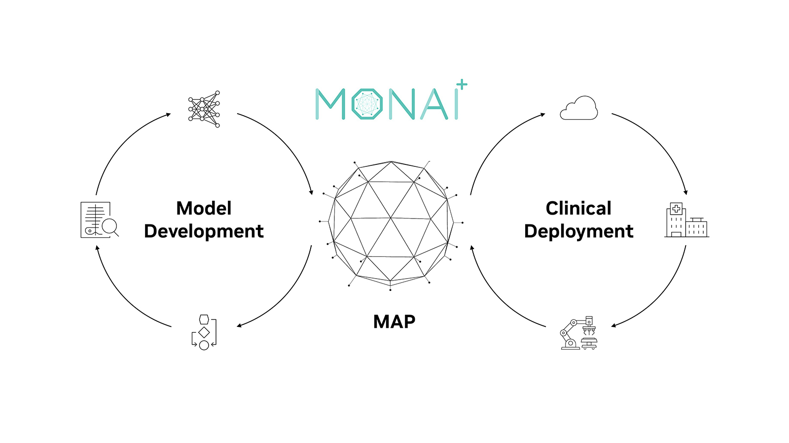
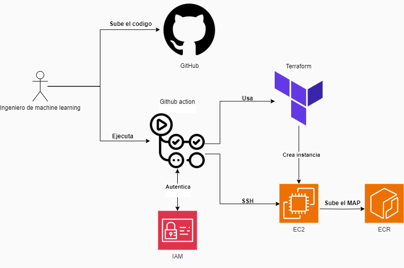
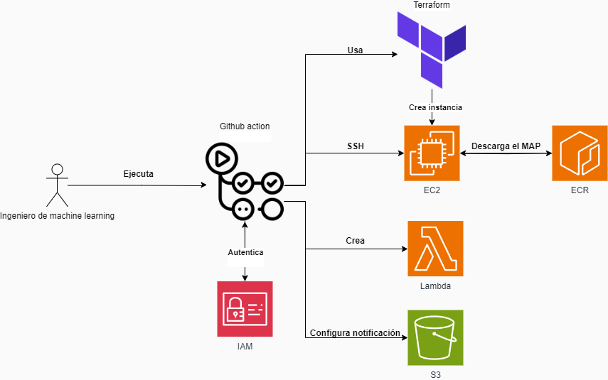
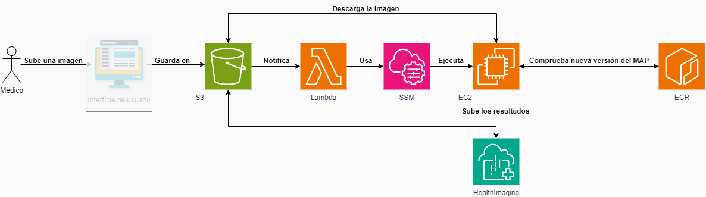

# Automatización del despliegue de modelos de inteligencia artificial hechos con MONAI a Amazon Web Services (AWS)

## Autores y Centro de Estudios:

	Desarrollador: Tarek Ben Hemadouch (tarek.benhamdouch@estudiants.urv.cat)
	Tutora Docente: Jordi Massaguer Pla (jordi.massaguer@urv.cat)
 	Centro de Estudios: Universidad Rovira i Virgili (URV)
        

## Descripción del Proyecto

Este proyecto surgió ante la necesidad de facilitar el despliegue automatizado de modelos de inteligencia artificial para la inferencia en imágenes médicas tilizando servicios en la nube de Amazon Web Services (AWS). La inteligencia artificial está transformando el campo de la medicina, mejorando la eficiencia y precisión en el diagnóstico y tratamiento de enfermedades. En este contexto, MONAI (Medical Open Network for AI) proporciona una plataforma de código abierto para el desarrollo de modelos de IA en imágenes médicas, pero llevar estos modelos a producción sigue siendo un reto significativo.

Para realizar el proyecto se han utilizado GitHub Actions para automatizar y gestionar los servicios de AWS, permitiendo empaquetar los modelos y ejecutarlos sin necesidad de intervención humana. Además, se ha configurado el sistema para que realice la inferencia de manera autónoma cada vez que se sube una imagen a Amazon S3.

Esta automatización reduce el tiempo necesario para llevar un modelo desde la fase de desarrollo hasta la producción, garantizando consistencia y escalabilidad. El proyecto demuestra la eficacia y la viabilidad de esta prueba de concepto, permitiendo a los investigadores centrarse en la optimización de los modelos en lugar de en las tareas de despliegue, mejorando así la eficiencia y reduciendo los costos operativos.

## Ciclo de desarrolo de modelos en MONAI

El esquema ilustra el ciclo completo del desarrollo de modelos de IA médica con MONAI, desde la fase inicial de desarrollo del modelo hasta el despliegue clínico. En el centro del esquema se encuentra el MONAI Application Package (MAP), que sirve como punto de conexión clave entre estas dos fases. El MAP consiste en una imagen de un contenedor docker con el modelo entrenado y que contiene una aplicación ejecutable que dada una entrada, realiza la inferencia con el modelo para generar las salidas.

## Documentación de la Arquitectura
El proyecto se estructura en dos componentes principales: el backend y el frontend. El backend, gestionado principalmente con GitHub Actions, se centra en la creación y configuración del MAP, así como en la instancia EC2 que ejecuta la inferencia. Esta parte del proyecto ha sido nuestro foco principal, garantizando que los procesos de automatización y despliegue funcionen de manera eficiente y sin necesidad de intervención humana.

Para realizar esta prueba de concepto, se utilizará directamente Amazon S3. Sin embargo, cabe remarcar que en una versión definitiva del proyecto, sería necesario implementar una interfaz web que permitiera a los usuarios finales, como los médicos, interactuar con el sistema de forma más intuitiva y amigable. Esta interfaz web debería permitir la subida de imágenes y la visualización o descarga de los resultados sin tener que acceder directamente a S3, mejorando así la experiencia de usuario y asegurando una mayor seguridad y control sobre los datos

## Diagrama de creación del MAP

El diagrama ilustra el proceso de creación del MAP. El proceso empieza cuando el ingeniero de aprendizaje automático sube el código al repositorio de GitHub. A continuación, se ejecuta el flujo de trabajo que primero se autentica a AWS mediante credenciales IAM para tener acceso a los servicios. Una vez autenticado, se utiliza Terraform para gestionar y crear una instancia EC2. Esta máquina virtual está configurada con los paquetes y  erramientas requerides para empaquetar el modelo. Después, la GitHub Action se conecta a la instancia EC2 vía SSH para crear y subir el MAP a un registro de contenedores ECR (Elastic Container Registry)

## Diagrama de configuración de la inferencia

El diagrama muestra el proceso de configuración de la inferencia. Todo comienza cuando el ingeniero de plataformas ejecuta el flujo de trabajo. El primer paso de crear la instancia es muy parecido a la creación del MAP, pero en este caso, en vez de subir la imagen, la descargamos desde el ECR. A continuación, se crea una función Lambda que será la encargada de iniciar la inferencia. Por último, se configura S3 para que notifique a la función Lambda cada vez que se sube una nueva imagen. Esta configuración permite que la función Lambda active la instancia EC2 para descargar la imagen del S3 y ejecutar el proceso de inferencia automáticamente, asegurando una respuesta rápida a las subidas de archivos.

## Diagrama de ejecución de la inferencia

El diagrama muestra el proceso de ejecución de la inferencia. El proceso comienza cuando el médico sube una imagen. Idealmente, este paso se realizaría a través de una interfaz de usuario que facilitaría la interacción, pero para las pruebas, las imágenes se subirán directamente a S3. Una vez que la imagen está guardada en S3, el servicio genera una notificación y pone en marcha una función Lambda.

La función Lambda utiliza el servicio AWS Systems Manager (SSM) para iniciar la instancia EC2 y ejecutar el script de inferencia. La instancia EC2 descarga la imagen desde el S3 y comprueba si existe una nueva versión del MAP en ECR. Una vez completada la inferencia, los resultados se suben a HealthImaging para su posterior análisis.

## Servicios AWS Empleados

	Amazon EC2
	Amazon ECR
	AWS HealthImaging
	Amazon S3
	AWS Lambda
	AWS Identity and Access Management (IAM)
	Amazon CloudWatch
	AWS Systems Manager
	

## Resultados y conclusiones 
En conclusión, este proyecto ha demostrado que la prueba de concepto es viable y que se puede automatizar el proceso de despliegue de modelos de inteligencia artificial para la inferencia en imágenes médicas utilizando servicios en la nube de AWS. Mediante el uso de GitHub Actions para gestionar y automatizar los procesos de construcción, prueba y despliegue, se han obtenido buenos resultados, reduciendo significativamente el tiempo y los esfuerzos necesarios para llevar los modelos desde la fase de desarrollo hasta la producción. Cabe destacar que este proyecto se ha centrado principalmente en el backend, y se ha utilizado Amazon S3 para la gestión de los archivos. En un entorno de producción real, sería necesario desarrollar una interfaz que permita a los usuarios subir imágenes y acceder a los resultados de forma más intuitiva y segura.

## Código y Modelo
El código y el modelo utilizados como ejemplo en este proyecto se han sacado de la página oficial de MONAI y se pueden consultar en su repositorio GitHub: [https://github.com/Project-MONAI/monai-deploy-app-sdk](https://github.com/Project-MONAI/monai-deploy-app-sdk)

## Configuración de los Secretos en GitHub

Para que este proyecto funcione correctamente, es necesario configurar los secretos en el repositorio de GitHub con los siguientes valores:

- `AWS_ACCESS_KEY_ID`
- `AWS_SECRET_ACCESS_KEY`
- `AWS_ACCOUNT_ID`
- `AWS_REGION`
- `AWS_S3_BUCKET`
- `AWS_DATASTORE_ID`
- `AWS_LAMBDA_ROLE`
- `AWS_MEDICALIMAGING_ROLE`
